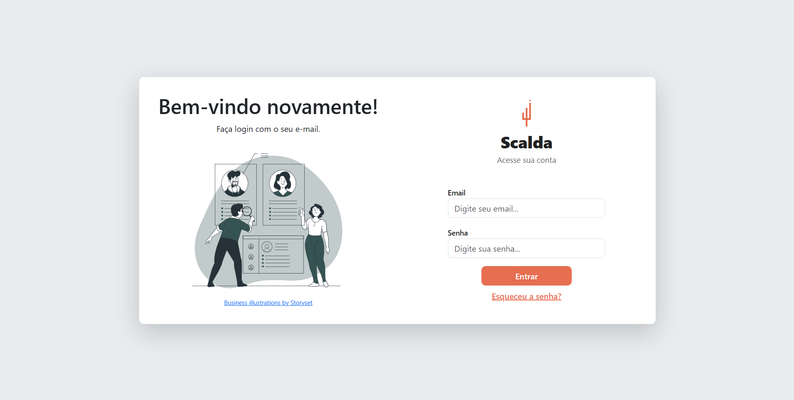
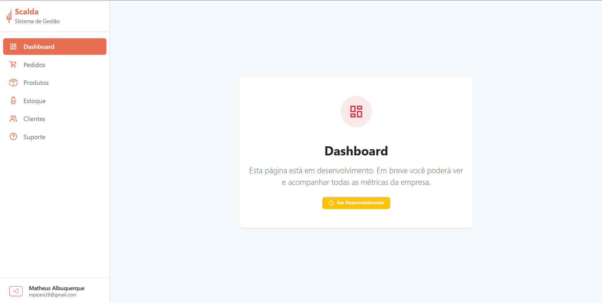
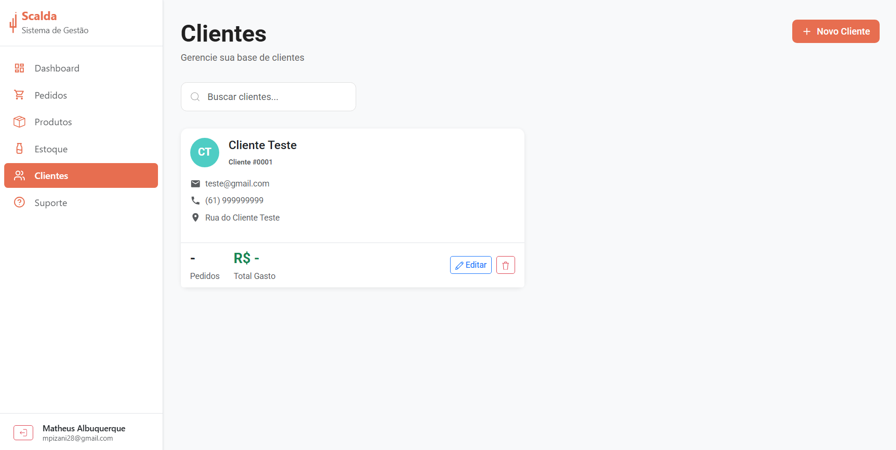
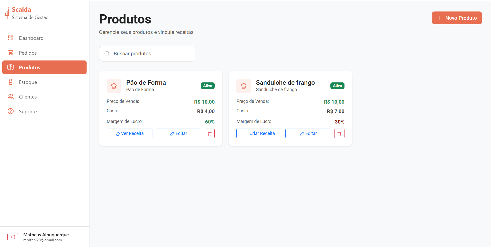
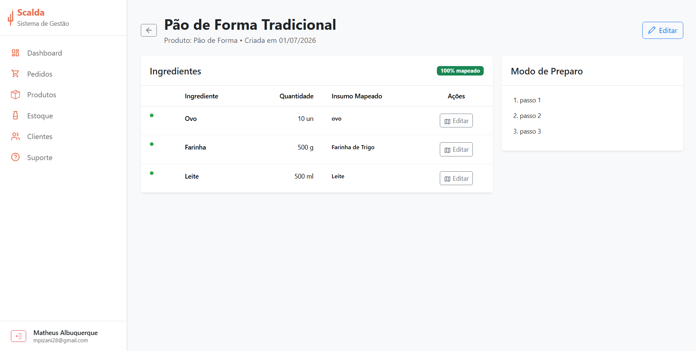
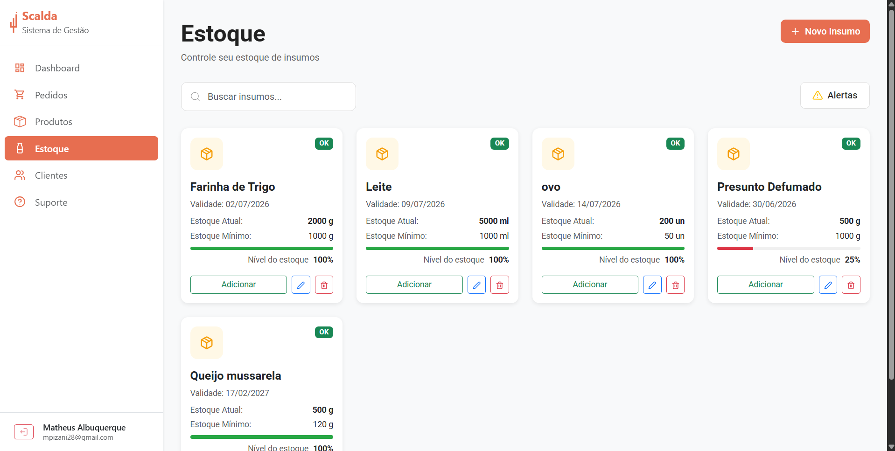
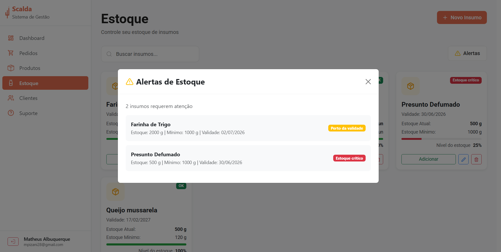
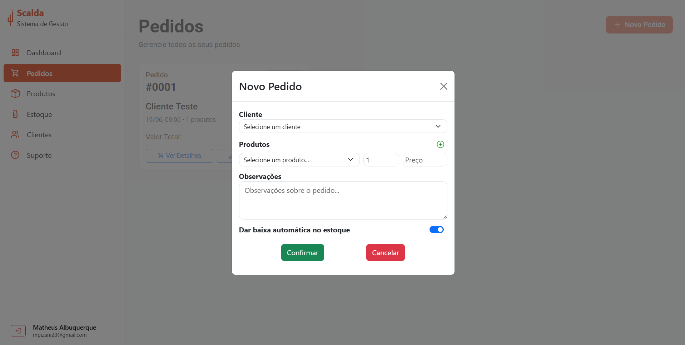
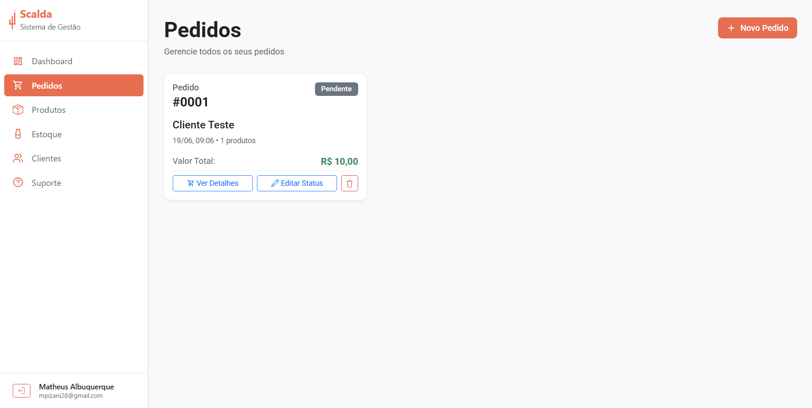

# Scalda — ERP para o Setor Alimentício

> Sistema web completo para lanchonetes, restaurantes e padarias gerenciarem clientes, produtos, receitas, estoque e pedidos — com baixa automática de insumos a cada venda realizada.

---

## Problema / Motivação

Empresas do setor alimentício frequentemente enfrentam três desafios simultâneos: **controlar o estoque de insumos**, **rastrear receitas de preparo** e **registrar pedidos** de forma integrada. Planilhas e sistemas genéricos não conectam esses pontos — quando um pedido é lançado, o estoque não é atualizado; quando um insumo acaba, ninguém é avisado antes que a operação seja impactada.

O **Scalda** resolve exatamente isso: ao registrar um pedido, o sistema calcula automaticamente quanto de cada insumo será consumido com base na receita do produto e faz a baixa no estoque. Alertas automáticos avisam quando um item está com quantidade crítica ou próximo do vencimento, antes que a produção pare.

**Usuário-alvo:** proprietários e operadores de lanchonetes, restaurantes e padarias de pequeno e médio porte que precisam de controle operacional integrado, sem complexidade.

---

## Funcionalidades Implementadas

- **Autenticação segura** via Supabase Auth (login com e-mail/senha e recuperação de senha)
- **Multi-tenant isolado:** cada empresa cadastrada na plataforma tem seus dados completamente separados das demais
- **Gestão de clientes:** cadastro, edição e listagem com dados de contato e endereço
- **Gestão de produtos:** cadastro com preço de venda, custo de produção e status ativo/inativo; suporte a vínculo com receita
- **Receitas com ingredientes:** descrição do modo de preparo e lista de ingredientes com quantidade e unidade de medida
- **Mapeamento ingrediente → insumo:** elo entre o ingrediente da receita e o item físico do estoque, com fator de conversão de unidades (ex.: 150 g → 0,15 kg)
- **Controle de estoque (insumos):** quantidade atual, unidade, data de validade e quantidade mínima configurável por item
- **Alertas automáticos de estoque:** classificação dinâmica em _Crítico Estoque Mínimo_, _Crítico Validade_, _Baixo Estoque_ e _Baixa Validade_ — sem necessidade de verificação manual
- **Gestão de pedidos:** criação com múltiplos produtos, vinculação opcional a um cliente e campo de observações
- **Baixa automática de estoque:** ao criar um pedido, o sistema desconta automaticamente os insumos com base nas receitas dos produtos
- **Verificação pré-pedido:** antes de confirmar o pedido, o sistema avisa se há ingredientes não mapeados ou estoque insuficiente
- **Acompanhamento de status do pedido:** ciclo _Pendente → Em Preparo → Em Rota de Entrega → Entregue_

---

## Arquitetura / Stack Técnica

| Camada | Tecnologia |
|---|---|
| **Frontend** | React 19, Vite 6, Bootstrap 5.3, TanStack Query v5, React Router DOM v7, Axios, Supabase JS SDK |
| **Backend** | Spring Boot 3.4, Java 21, Spring Security + OAuth2 Resource Server, MapStruct, Lombok, Flyway |
| **Banco de Dados** | PostgreSQL via Supabase (produção) / Neon.tech (desenvolvimento) |
| **Autenticação** | Supabase Auth — JWT RS256 com validação por JWKS |
| **Isolamento multi-tenant** | Shared schema com discriminador `empresa_id` por linha + `TenantContext` (ThreadLocal no backend) |

O frontend consome a API REST do backend, que valida o JWT do Supabase em cada requisição e aplica isolamento automático por empresa — nenhum dado de uma empresa é acessível por outra.

---

## Como Funciona (Fluxos Principais)

### Login e Acesso


*Legenda: Tela de login do Scalda.*

---

### Dashboard / Métricas


*Legenda: Página de métricas (`/metricas`).*

---

### Gestão de Clientes


*Legenda: Página de clientes (`/clientes`).*

---

### Gestão de Produtos


*Legenda: Página de produtos (`/produtos`).*

---

### Receitas e Mapeamento de Ingredientes


*Legenda: Página de detalhe de receita (`/receitas/:id`).*

---

### Controle de Estoque com Alertas


*Legenda: Página de estoque (`/estoque`).*


*Legenda: Modal de alertas de estoque.*

---

### Criação de Pedido com Verificação de Estoque


*Legenda: Modal de formulário de novo pedido em `/pedidos`.*

---

### Acompanhamento de Pedidos


*Legenda: Página de pedidos (`/pedidos`).*

---

## Roadmap / Melhorias Futuras

- **Dashboard analítico:** gráficos de faturamento por período, produtos mais vendidos, insumos com maior consumo e evolução do estoque ao longo do tempo
- **Integração com WhatsApp:** recebimento e geração automática de pedidos via mensagens no WhatsApp, eliminando a necessidade de digitação manual
- **Controle de acesso por perfil (roles):** restrição de operações por papel do usuário (admin, operador, visualizador) — ex.: apenas admins podem deletar produtos ou dar baixa manual no estoque
- **Planos de acesso:** funcionalidades liberadas conforme o plano contratado pela empresa (básico, profissional, enterprise)
- **Audit log:** registro de operações críticas (criação de pedidos, exclusões, baixa de estoque) com usuário, empresa e timestamp
- **Testes automatizados:** cobertura com testes unitários e de integração para garantir estabilidade das regras de negócio
- **Otimizações de performance:** índices de banco de dados para escala com múltiplos clientes simultâneos

---

## Estrutura do Projeto

```
CadastroUsuariosSoft/
├── frontend/       # React 19 + Vite
├── backend/        # Spring Boot 3.4 (Java 21) — backend principal
└── docs/           # Documentação técnica (arquitetura, banco, segurança, domínio)
```
